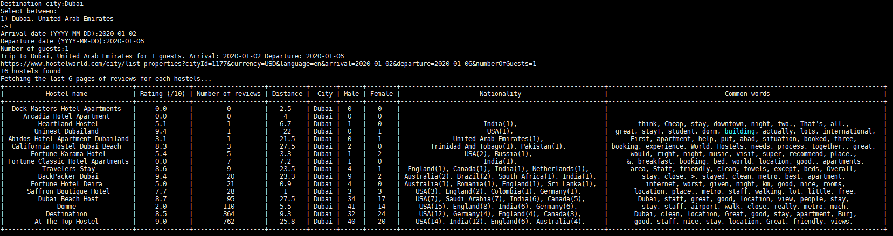
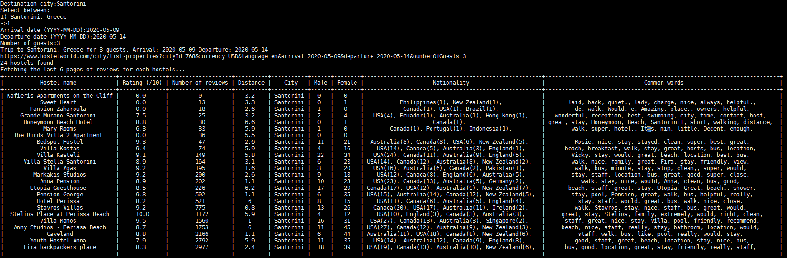

# Hostelworld-Finder
Returns the best hostels from hostelworld.com given a location and date. The hostelworld website filters weren't flexible enough for my needs so i decided to process the results from their JSON API. This script allows to:

- Sort the hostels by number of reviews
- Process the comments made by users
    - By default, only the first 6 pages are fetched for each hostels, using 15 threads
    - Get the most frequent words used
    - Count Male/Female
    - Count users nationality
    
## Dependency
```
# apt-get install python3-setuptools
# pip3 install prettytable
```



